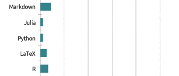

### Hola 


Me llamo **Daniel**, estudié Actuaría en la UNAM :heart:, me gusta leer, dibujar, tocar guitarra, actualmente estoy aprendiendo el lenguaje de programación **julia** y trato de mejorar mis habilidades en **R**. 




````
@gif for i ∈ 1:n
    circleplot(x, y, i, line_z = 1:n, cbar = false, c = :blues, framestyle = :none)
end when i > 40 && mod1(i, 10) == 5
````

<!--
**san-daniel/san-daniel** is a ✨ _special_ ✨ repository because its `README.md` (this file) appears on your GitHub profile.

Here are some ideas to get you started:

- 🔭 I’m currently working on ...
- 🌱 I’m currently learning ...
- 👯 I’m looking to collaborate on ...
- 🤔 I’m looking for help with ...
- 💬 Ask me about ...
- 📫 How to reach me: ...
- 😄 Pronouns: ...
- ⚡ Fun fact: ...
-->
